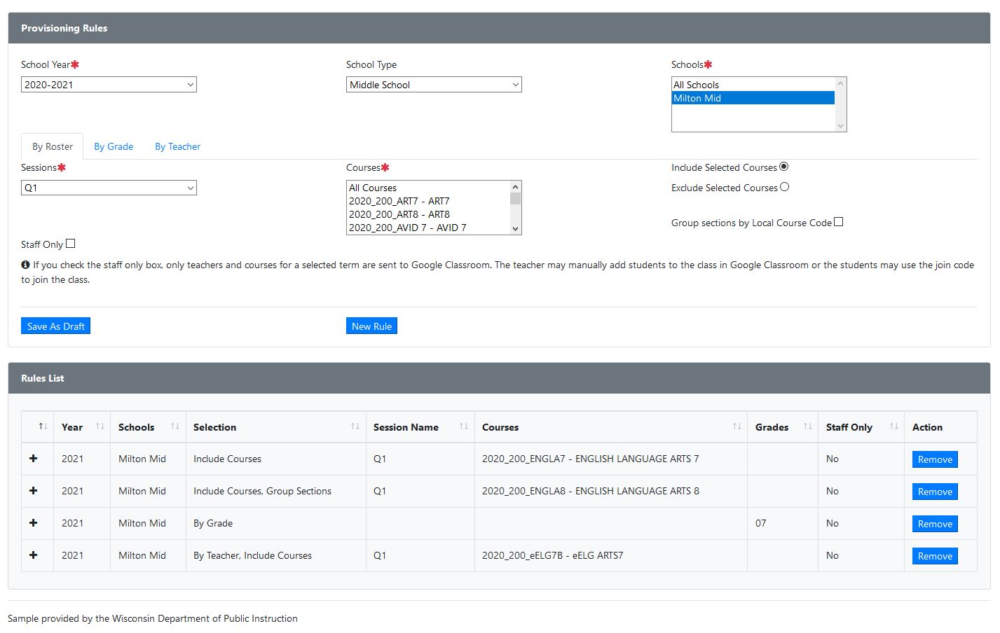
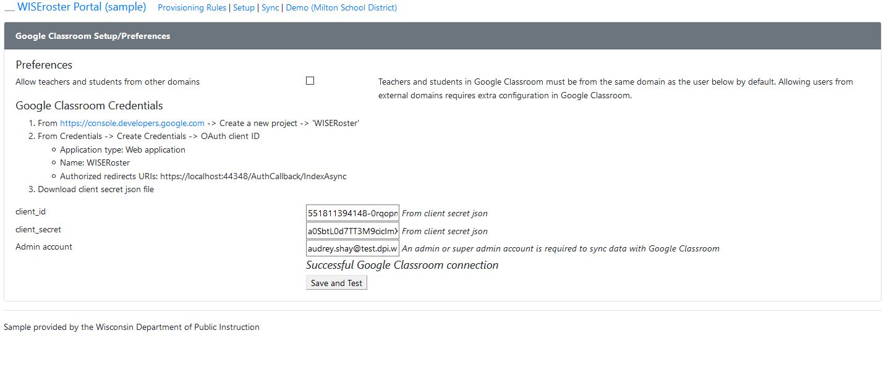
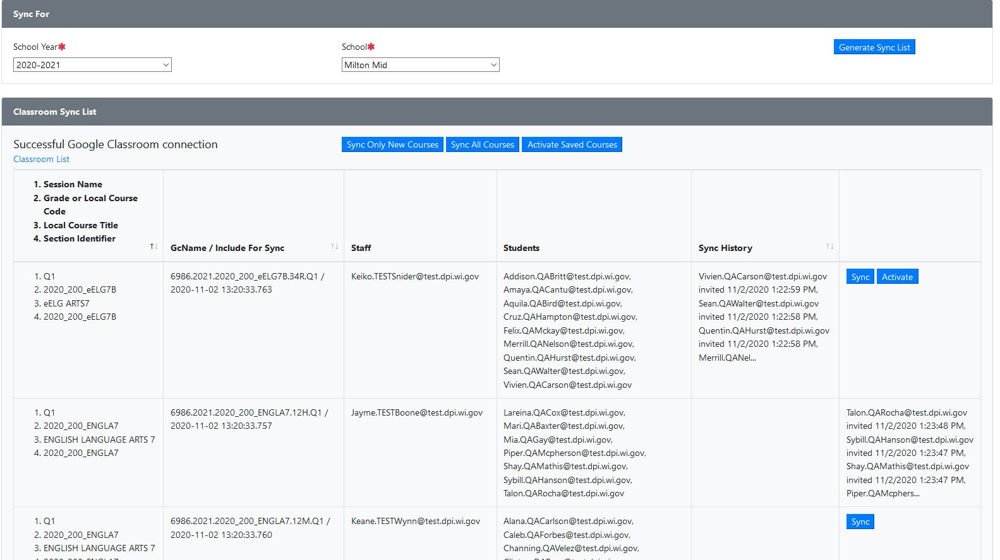
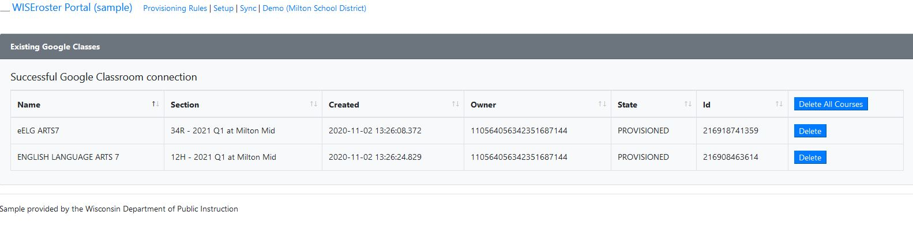

# WISEroster Sample

WISEroster is a web application which is designed for a state implementation to enable LEA administrators to leverage data stored in an Ed-Fi API database to provision classes in Google Classroom.  This is designed as a one-way system to move data from Ed-Fi into Google Classroom.  It provides a way to proactively set up classes in bulk, but it is not a Google Classroom management solution.  

In WISEroster, provisioning rules are created to determine which classes should be added to Google Classroom.  Options include whole grade classes, selecting courses per section or grouped under the same course code, and selecting courses by teacher.  A list of classes is then generated and each school may be individually synced to Google Classroom- this includes sending invitations to teachers and students.

WISEroster is designed to work within a 'project' scope in Google Classroom and requires an admin-level account.  Classes are owned by the admin account and may be deleted at the class level either individually or in bulk in WISEroster.  Classes may be repeatedly synced to invite additional students or staff, but no invitations will be deleted programmatically.  Changes made in Google Classroom are not propagated back to WISEroster.    

A note on authentication and authorization: the State of Wisconsin has a statewide authentication system (WAMS) which is accessible to anyone in the state including districts and vendors and the Wisconsin Department of Public Instruction has a separate authorization system (ASM/WISEsecure) which provides authorization for its applications.  These two systems are integral to the functioning of the WISEroster application, but are not included in this sample.  Those components have been removed and default values are inserted to allow it to function in demo form.

## What Is Included
### Provisioning Rules

### Credential Setup

### Sync

### Classroom List

## Getting Started

### Database
WISEroster is designed to connect to a V3 year-based API instance.  Code generation was run on the API with the Change Queries feature turned on.  It may be re-run if the feature is turned off (WISEroster.Domain/Api/V3Api.tt).

A SQL Server database project is included for the WISEroster database.  Because Google API connection information is stored in the database, it is encrypted at rest. Stored procedures in the 'sec' schema are used for Read/Upsert/Delete. These procedures use a certificate 'PII_cert_WISEroster' and a symmetric key 'PII_symkey_sec'.  Scripts for these ARE NOT included.

### Code
The ImplementationSpecific folder in the in the Ed-Fi.Credential.MVC project contains the bulk of the dummy code for WI DPI integration points for this project, but several files will need adjustments:

1. Configure the connectionStrings and DPI.AgencyKey in the web.config in the WISEroster.MVC project
1. Verify pathing in WISEroster.MVC/Classroom/AppFlowMetadata.cs AuthCallback()
1. Adjust DPI_EMAIL_DOMAIN in WISEroster.MVC/Classroom/GcSync.cs
1. Review WISEroster.MVC/ImplementationSpecific/DebugWamsAuthenticationFilter.cs and adjust the EducationOrganizationId and AgencyName for an organization which exists in the target API database.

## Copyright
Copyright 2020 Wisconsin Department of Public Instruction.

## License
Licensed under the Apache License, Version 2.0 (the "License"); you may not use this file except in compliance with the License. You may obtain a copy of the License at

    http://www.apache.org/licenses/LICENSE-2.0

Unless required by applicable law or agreed to in writing, software distributed under the License is distributed on an "AS IS" BASIS, WITHOUT WARRANTIES OR CONDITIONS OF ANY KIND, either express or implied.
See the License for the specific language governing permissions and limitations under the License.
